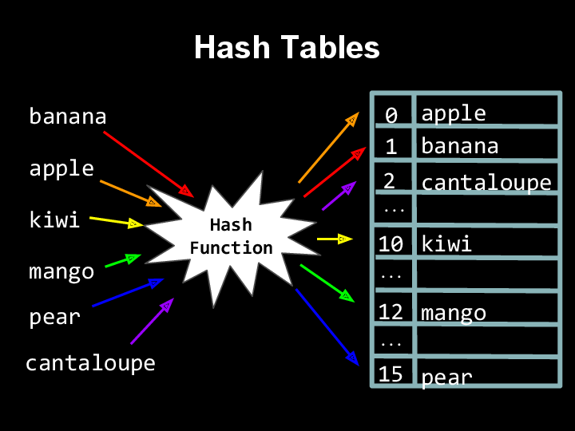
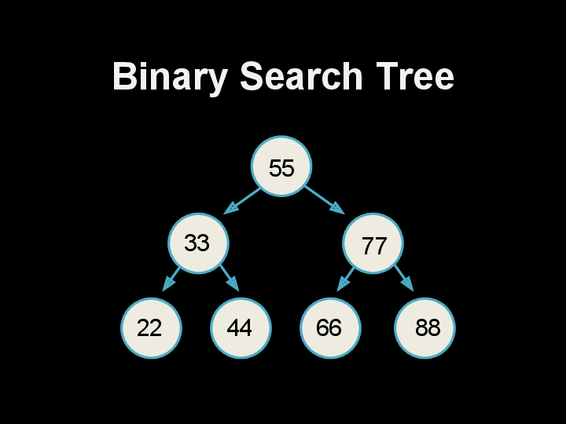

# Section #4

## Shorts

- [Week 4 Shorts Playlist](https://www.youtube.com/playlist?list=PLhQjrBD2T382J67971BI3E-2tuyMedGb_)

## Outline

- `struct`s
- Linked lists
- Hash tables
- Tries  
- Stacks and queues

### Structures and `typedef`

- Structures provide a way to unify several variables of different data types into a single distinct unit, almost like a "super-variable".
- The variables contained within a field are sometimes called "attributes," or "fields," or "members."
- We typically define our structures by _defining_ a new custom type, which we can do with the `typedef` keyword.
- We also typically define structures inside of a `.h` file to abstract them away and make them able to be used by other programs as well.
- Individual fields of the structure are accessed using the dot operator (`.`).
- Structures can be dynamically allocated as well, using `malloc()`.
- In order to access the fields of a dynamically allocated structure, we must first dereference the pointer and then access the field.
    - `(*struct).field`
    - `struct->field`

### Linked Lists

- Arrays are great for lookup, but bad for insertion and deletion.
- Arrays are also inflexible; we can't resize them if the amount of data we needs grows or shrinks.
- Linked lists are a collection of `node`s (themselves just a special `struct`), where each node contains data and a pointer to another `node`, which creates a chained (linked) collection of data.
- We can traverse the pointers to access each element.
- You will most likely use linked lists in your implementation of a hash table. For `dictionary.c`, you will most likely construct a hash table of pointers to `node`s, where collisions are handled by pre-pending onto the start of
a linked list.
- The basic operations you should be able to do are:
    - Create a linked list
    - Insert into a linked list (requires `malloc`ing a `node`)
    - Delete an entire linked list
    - Iterate over the elements of a linked list
- Below is the definition of a `node`
```c
typedef struct node
{
    // just some form of data; could be a char* or whatever
    int i;

    // pointer to next node; have to include 'struct' since this is a recursive definition
    struct node* next;

}
node;
```
- The end of a linked list will always be marked by a pointer to `NULL`.
Be careful about the order of operations, though! Especially when inserting, if done in the wrong order you could lose track of your list!

### Hash Tables

- A hash table is an "associative array" where the position of each element is decided by (associated with) the result of passing data into a _hash function_.
- A hash function can be anything; for example, if placing strings into a hash table, your hash table could be of size 26 while your function distributes words based on their first character.
- Alternatively, you may choose to create a larger hash table and calculate where to put a word based on the summation of a word's characters.

- A hash function describes where to insert a word and, when necessary, where to look up a word.
- In an ideal world a hash table will provide constant time lookup (which is possible if there are no collisions when inserting!) However, this is in most cases not likely.
- When inserting a word into a hash table, if there is a collision you can either:
    - chain items, such that each element of the hash table is a linked list of `node`s (preferred!); or
    - probe for an open index.
- If, for example, you wanted to insert the word *Elphie* into a hash table where the word *Milo* already is, you might iterate over nearby indexes, placing the word into whatever space is free.
- Alternatively, you could decide to chain elements into a linked list. The goal of every hash function is to try and minimize these kinds of collisions since dealing with them is computationally expensive.
- Lookup operations in hash tables are technically still _O_(_n_) time, but really it tends more towards _O_(_1_), since you are dividing _n_ typically by a large constant, _k_. In the best case, Ω(1) time.

### Trees and Tries

- Every trie is a tree but not all trees are tries!
- A binary search tree, to tie back to a familiar idea, is a tree that is organized in such a way as to make binary search more approachable. It is organized such that every parent node can have, at most, 2 child nodes whose positions follow a set pattern, binary search trees greatly simplify data lookup.
- Here, for example, each left child node is smaller than its parent, while each right node is greater than its parent:

- Searching for 88 in this tree with 7 nodes, thus, would only take 3 operations - same as binary search.
- A trie is a special kind of tree used primarily to store strings character by character. When creating nodes, instead of simply creating a pointer to a new node, it's necessary to instead create an array full of node pointers, like this:
```c
typedef struct node
{
    // marker for end of word
    bool is_word;

    // array of node* that
    struct node* children[27];

} node;
```
- By using arrays, tries _try_ to capitalize on the speed (constant time lookup) of arrays.
- Although tries, in theory, provide constant time lookup, they use large amounts of memory - as always, there is a trade off between speed and memory!

### Stacks and Queues

- Both stacks and queues can be implemented with either an array or a linked list. The below descriptions assume array implementations:
    - Stacks, kind of like stack memory, are FILO (first in last out) data structures where elements on the stack are successively 'pushed' down as other items are added.
    - As elements are removed, they are 'popped' off. It's important to keep track of both the `size` and `capacity` of your stack data structure as each will determine, respectively, where the next element should be added and if any more elements can be pushed onto the stack.
    - Queues, alternatively, are FIFO (first in first out) data structures.
        - Picture a line to any event - those in the front who showed up first are also allowed in first.
    - Instead of 'pushing' and 'popping' from a queue, the analogous terms are 'enqueue' and 'dequeue'.
    - Like stacks, it's important to keep track of both the `size` and `capacity` of your queue.
    - It's also, however, important to keep track of an additional `head` variable that signifies the start of the queue (since the start of the queue will not always be at index 0!).
